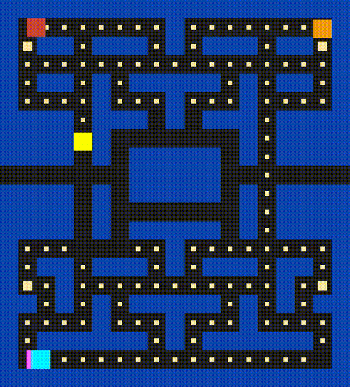

# Pacman

A Pac-Man clone based on SDL.
The project is made as practice in writing C++ code and is created for the 
Capstone project of [Udacity C++ Nanodegree Program](https://www.udacity.com/course/c-plus-plus-nanodegree--nd213). 

The implementation is not (yet) a clone of the original Pac-Man. It misses important functionality.
As example the 4 ghosts now have random movement while they should follow pacman in different ways,
see also [Ghost Movement](https://en.wikipedia.org/wiki/Ghosts_(Pac-Man)).

The game while running should look as follows:

Once all the dots & pellets are collected the game closes and prints your score to the console.
If the pacman collides with a ghost it is game over and the window closes. Your score is printed to
the console. Good luck with your new try!

## Repository Structure
* All the source & header files can be found in src/
* The levels can be found in levels/

## Code Structure & Objects
* Movement base class for moving entities. The crucial insight is that for continous movement there
  should be two variables: (1) wanted direction and (2) direction (current). The wanted direction is
  checked if possible otherwise entity keeps on moving in direction if possible.
  * Ghost base class for the 4 Ghosts  that inherets from Movement & SDL_FRect
    * Blinky, Clyde, Inky & Pinky inherets from Ghost, overrides moveMethod() for unique behaviour 
      per character. Currently the difference in behaviour is the random generator used.
  * Pacman inherets from Movement & SDL_FRect. Additionaly carries a boolean to state if pacman is
    alive
* Level is responsible for loading in levels from the directory levels/ uses std::filesystem
  (C++17) for this. Currently only default.txt can be read in. But user can modify default.txt.
  The conversion from character to game entities is: 
  1. o = Dot
  2. p = Pellet
  3. P = pacman
  4. = = wall
  5. b = blinky
  6. c = clyde
  7. i = inky
  8. p = pinky
* Game manages the game loop: controller input -> game state update -> render.
  The game state updates handles game logic, it moves the entities, handles collisions & changes
  game state (running).
* Dot a rectangle (could be a SDL_Rect) but for future extensibility it is not yet. I would like it
  to be round, which is not yet implemented.
* Pellet (is a dot) but inside a separate vector from the dots vector such that game state can be updated accordingly.
  Once a pellet is eaten the ghosts become scared & edible.
* Renderer  uses SDL to draw with specified color in code the entities to the screen.
* Controller currently only supports arrow keys on keyboard only. Controls the wanted direction of
  Pacman for moving. Also handles the case the user closes the window.

## Notes
* SDL is packaged with the repo so no system SDL should be necessary! (only tested on arch linux)

## Thanks
* Thanks for http://carlosalface.blogspot.pt/ Carlos Alface for the art

## Dependencies for Running Locally
* cmake >= 3.7
  * All OSes: [click here for installation instructions](https://cmake.org/install/)
* make >= 4.1 (Linux, Mac), 3.81 (Windows)
  * Linux: make is installed by default on most Linux distros
  * Mac: [install Xcode command line tools to get make](https://developer.apple.com/xcode/features/)
  * Windows: [Click here for installation instructions](http://gnuwin32.sourceforge.net/packages/make.htm)
* gcc/g++ >= 5.4
  * Linux: gcc / g++ is installed by default on most Linux distros
  * Mac: same deal as make - [install Xcode command line tools](https://developer.apple.com/xcode/features/)
  * Windows: recommend using [MinGW](http://www.mingw.org/)

## Basic Build Instructions

1. Clone this repo.
2. Make a build directory in the top level directory: `mkdir build && cd build`
3. Compile: `cmake .. && make`
4. Run it: `./PacmanGame`.

